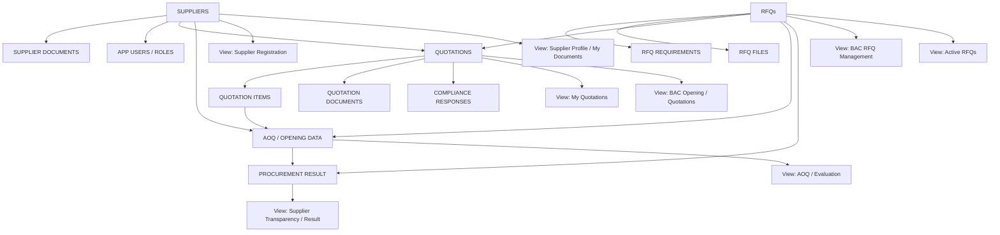

# AppSheet RFQ System — Build Order

**Status:** Working build guide / starting architecture

This diagram is intended as a practical order for building the AppSheet RFQ System. Build the data tables first, then relationships/actions, then views. Do not try to build every view at once.

## 1. Overall order



## 2. Recommended table creation sequence

### Phase 1 — Foundation

Create these first because other tables depend on them.

1. **SUPPLIERS**
   - Supplier Registration No. (Key)
   - Supplier Name
   - TIN / registration information as required
   - Address
   - Contact Person
   - Email
   - Contact Number
   - Status
   - Registration Date

2. **SUPPLIER DOCUMENTS**
   - Supplier Document ID (Key)
   - Supplier Registration No. (Ref → SUPPLIERS)
   - Document Type
   - Document Number
   - Date Issued
   - Expiry Date
   - File
   - Status

3. **APP USERS / ROLES**
   - User Email (Key)
   - Supplier Registration No. where applicable
   - Role
   - Active

> The exact authentication design for external suppliers is still a parked decision. This table is only the initial role model.

### Phase 2 — RFQ master data

4. **RFQs**
   - RFQ No. (Key)
   - PR No.
   - Procurement Mode
   - Project / Requirement
   - End-User
   - Date Posted / Opened for Submission
   - Submission Deadline
   - Opening Date/Time
   - Status
   - Other RFQ master fields

5. **RFQ REQUIREMENTS**
   - RFQ Requirement ID (Key)
   - RFQ No. (Ref → RFQs)
   - Requirement / Document Type
   - Required?
   - Instructions

6. **RFQ FILES**
   - RFQ File ID (Key)
   - RFQ No. (Ref → RFQs)
   - File Type
   - File
   - Description

### Phase 3 — Quotation transaction

7. **QUOTATIONS**
   - Quotation ID (Key)
   - RFQ No. (Ref → RFQs)
   - Supplier Registration No. (Ref → SUPPLIERS)
   - Submission Date/Time (system-generated)
   - Submission Status
   - Locked / Sealed status
   - Opening Date/Time
   - Opened By
   - Opened Date/Time
   - Final / withdrawn indicator if resubmission is eventually allowed

8. **QUOTATION ITEMS**
   - Quotation Item ID (Key)
   - Quotation ID (Ref → QUOTATIONS)
   - RFQ item/reference
   - Item Description
   - Quantity
   - Unit
   - Unit Price
   - Item Amount

9. **QUOTATION DOCUMENTS**
   - Quotation Document ID (Key)
   - Quotation ID (Ref → QUOTATIONS)
   - Document Type
   - File
   - Uploaded Date/Time

10. **COMPLIANCE RESPONSES**
    - Compliance Response ID (Key)
    - Quotation ID (Ref → QUOTATIONS)
    - RFQ Requirement / Item
    - Supplier Response
    - Supporting File where applicable

### Phase 4 — Opening, AOQ and result

11. **AOQ / OPENING DATA**
    - AOQ/Opening record ID (Key)
    - RFQ No. (Ref → RFQs)
    - Quotation ID (Ref → QUOTATIONS)
    - Supplier Registration No. (Ref → SUPPLIERS)
    - Encoded price data / totals after opening
    - Verification / discrepancy status
    - Evaluation-related fields as eventually determined

12. **PROCUREMENT RESULT**
    - Result ID (Key)
    - RFQ No. (Ref → RFQs)
    - Result / award status
    - Date
    - Result file(s)
    - Remarks

## 3. Recommended view creation sequence

Do not create the views until the underlying tables and key relationships are working.

### Supplier side

**View 1 — Supplier Registration**

Public/accessible registration entry point.

Purpose: create the supplier record and issue the Supplier Registration No.

↓

**View 2 — Supplier Profile / My Documents**

Purpose: allow the registered supplier to maintain its profile and upload/update documents.

↓

**View 3 — Active RFQs**

Purpose: show RFQs that are currently open for submission.

Only registered/active suppliers should be allowed to proceed to quotation submission.

↓

**View 4 — RFQ Detail / Submission**

Purpose: display the RFQ and allow the supplier to:

- encode structured quotation data;
- upload the signed quotation;
- submit Compliance to Specifications;
- upload other required documents; and
- finally submit/lock the quotation.

↓

**View 5 — My Quotations**

Purpose: let the supplier see its own submissions and their status.

↓

**View 6 — AOQ / Result for Participating Suppliers**

Purpose: after release, allow a supplier to view the AOQ/result for RFQs in which it submitted a quotation.

### BAC Secretariat side

**View 7 — BAC Dashboard / RFQ Management**

Purpose: create/manage RFQs, deadlines, requirements and status.

↓

**View 8 — RFQ Detail / Submitted Bids**

Before opening: show submission metadata only; quotation contents remain sealed.

After opening: show authorized quotation contents, files and compliance submissions.

↓

**View 9 — Opening / Evaluation Workspace**

Purpose: work with the structured quotation data and documentary submissions after opening.

↓

**View 10 — AOQ / Procurement Result**

Purpose: review/generate AOQ and upload the final procurement result.

## 4. The important relationship chain

The core data relationship should eventually look like this:

```text
SUPPLIER
   │
   ├── SUPPLIER DOCUMENTS
   │
   └── QUOTATIONS
          │
          ├── QUOTATION ITEMS
          ├── QUOTATION DOCUMENTS
          └── COMPLIANCE RESPONSES

RFQ
   │
   ├── RFQ REQUIREMENTS
   ├── RFQ FILES
   └── QUOTATIONS
          │
          └── AOQ / OPENING DATA
                    │
                    └── PROCUREMENT RESULT
```

## 5. Build this first

If building from scratch, the recommended first milestone is **not the supplier-facing form**. First create:

```text
SUPPLIERS
SUPPLIER DOCUMENTS
APP USERS / ROLES
RFQs
RFQ REQUIREMENTS
RFQ FILES
```

Then establish the Ref relationships.

Only after those are working should the quotation tables be created:

```text
QUOTATIONS
QUOTATION ITEMS
QUOTATION DOCUMENTS
COMPLIANCE RESPONSES
```

Then build the supplier submission workflow and the Secretariat opening workflow.

## 6. Deliberately parked items

These are not final implementation decisions yet:

- Exact supplier authentication method.
- Exact Google Drive/file-permission model for sealed quotations.
- Exact mechanism for opening/releasing sealed quotations.
- Whether bidders can withdraw/resubmit before the deadline.
- Exact AOQ table structure and GAS generation logic.
- File hashing/integrity verification.
- Final transparency/publication rules.

The diagram is therefore a **build sequence**, not a final database specification. Adjust field names and tables as the actual AppSheet implementation develops.